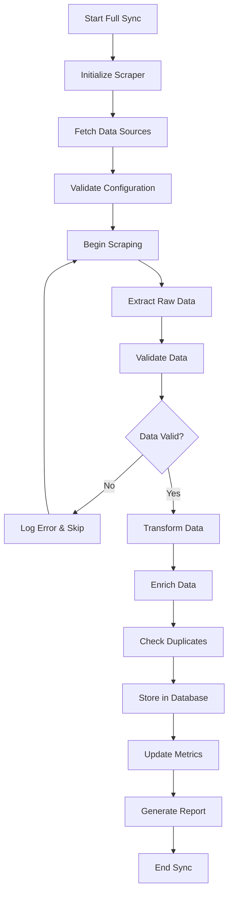
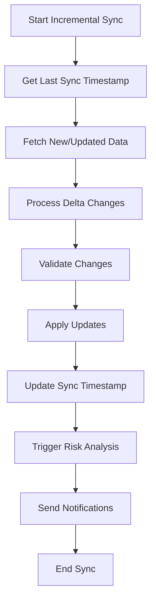

# Data Ingestion Pipeline Design for Romanian Public Procurement Platform

## Overview

The data ingestion pipeline is designed to collect, process, and normalize tender data from multiple Romanian procurement sources. The system must handle diverse data formats, varying update frequencies, and ensure data quality while maintaining real-time capabilities.

## Data Sources Analysis

### 1. SICAP (Sistema Informatic de Contracte pentru Achizitii Publice)
**Source Type**: Web scraping + API (limited)
**Update Frequency**: Real-time to daily
**Data Format**: HTML pages, some XML/JSON APIs
**Volume**: ~1,000-5,000 tenders/day
**Challenges**:
- Dynamic content loading (JavaScript rendering)
- Anti-scraping measures
- Inconsistent data formats
- Rate limiting requirements

### 2. ANRMAP (Autoritatea Nationala pentru Reglementarea si Monitorizarea Achizitiilor Publice)
**Source Type**: Web scraping + potential APIs
**Update Frequency**: Daily to weekly
**Data Format**: HTML, PDF documents, XML feeds
**Volume**: ~500-1,000 tenders/day
**Challenges**:
- PDF document parsing
- Regulatory report formats
- Seasonal data availability

### 3. Local Municipality Websites
**Source Type**: Web scraping (diverse formats)
**Update Frequency**: Weekly to monthly
**Data Format**: HTML, PDF, DOC files
**Volume**: ~200-500 tenders/day combined
**Challenges**:
- Highly diverse formats
- Inconsistent data quality
- Many different website structures
- Limited standardization

### 4. EU TED (Tenders Electronic Daily)
**Source Type**: Official APIs + XML feeds
**Update Frequency**: Daily
**Data Format**: XML, JSON APIs
**Volume**: ~100-300 Romanian tenders/day
**Challenges**:
- Large XML files
- Complex data structures
- Multi-language content
- Rate limiting

## Data Ingestion Architecture

```
┌─────────────────────────────────────────────────────────────────┐
│                    DATA INGESTION PIPELINE                      │
├─────────────────────────────────────────────────────────────────┤
│                                                                 │
│  ┌─────────────────┐  ┌─────────────────┐  ┌─────────────────┐ │
│  │   SCHEDULERS    │  │   DATA SOURCES  │  │   SCRAPERS      │ │
│  │                 │  │                 │  │                 │ │
│  │  ┌───────────┐  │  │  ┌───────────┐  │  │  ┌───────────┐  │ │
│  │  │ Celery    │  │  │  │   SICAP   │  │  │  │Playwright │  │ │
│  │  │ Beat      │  │  │  │           │  │  │  │ Scraper   │  │ │
│  │  └───────────┘  │  │  └───────────┘  │  │  └───────────┘  │ │
│  │                 │  │                 │  │                 │ │
│  │  ┌───────────┐  │  │  ┌───────────┐  │  │  ┌───────────┐  │ │
│  │  │ Cron      │  │  │  │  ANRMAP   │  │  │  │ Requests  │  │ │
│  │  │ Jobs      │  │  │  │           │  │  │  │ Scraper   │  │ │
│  │  └───────────┘  │  │  └───────────┘  │  │  └───────────┘  │ │
│  │                 │  │                 │  │                 │ │
│  │  ┌───────────┐  │  │  ┌───────────┐  │  │  ┌───────────┐  │ │
│  │  │ Event     │  │  │  │Local Muni │  │  │  │ BeautifulSoup│  │
│  │  │ Triggers  │  │  │  │ Websites  │  │  │  │ Parser    │  │ │
│  │  └───────────┘  │  │  └───────────┘  │  │  └───────────┘  │ │
│  │                 │  │                 │  │                 │ │
│  │                 │  │  ┌───────────┐  │  │  ┌───────────┐  │ │
│  │                 │  │  │  EU TED   │  │  │  │ API       │  │ │
│  │                 │  │  │           │  │  │  │ Clients   │  │ │
│  │                 │  │  └───────────┘  │  │  └───────────┘  │ │
│  └─────────────────┘  └─────────────────┘  └─────────────────┘ │
│                                                                 │
└─────────────────────────────────────────────────────────────────┘
                                │
                                │ Raw Data
                                │
┌─────────────────────────────────────────────────────────────────┐
│                    DATA PROCESSING PIPELINE                     │
├─────────────────────────────────────────────────────────────────┤
│                                                                 │
│  ┌─────────────────┐  ┌─────────────────┐  ┌─────────────────┐ │
│  │ DATA VALIDATION │  │ DATA TRANSFORM  │  │ DATA ENRICHMENT │ │
│  │                 │  │                 │  │                 │ │
│  │ • Format Check  │  │ • Normalization │  │ • CPV Mapping   │ │
│  │ • Required      │  │ • Date Parsing  │  │ • Geo Coding    │ │
│  │   Fields        │  │ • Text Cleaning │  │ • Company       │ │
│  │ • Data Types    │  │ • Currency Conv │  │   Matching      │ │
│  │ • Business      │  │ • Duplicate     │  │ • Classification│ │
│  │   Rules         │  │   Detection     │  │ • Risk Scoring  │ │
│  └─────────────────┘  └─────────────────┘  └─────────────────┘ │
│                                                                 │
└─────────────────────────────────────────────────────────────────┘
                                │
                                │ Processed Data
                                │
┌─────────────────────────────────────────────────────────────────┐
│                       DATA STORAGE                              │
├─────────────────────────────────────────────────────────────────┤
│                                                                 │
│  ┌─────────────────┐  ┌─────────────────┐  ┌─────────────────┐ │
│  │   POSTGRESQL    │  │   REDIS CACHE   │  │   FILE STORAGE  │ │
│  │                 │  │                 │  │                 │ │
│  │ • Normalized    │  │ • Temp Data     │  │ • Documents     │ │
│  │   Data          │  │ • Processing    │  │ • Images        │ │
│  │ • Relationships │  │   Cache         │  │ • PDFs          │ │
│  │ • Indexes       │  │ • Rate Limits   │  │ • Archives      │ │
│  │ • Constraints   │  │ • Session Data  │  │ • Logs          │ │
│  └─────────────────┘  └─────────────────┘  └─────────────────┘ │
│                                                                 │
└─────────────────────────────────────────────────────────────────┘
```

## Data Ingestion Components

### 1. Scheduler System

```python
# Celery Beat Configuration
CELERY_BEAT_SCHEDULE = {
    'sicap-full-sync': {
        'task': 'ingestion.tasks.sicap_full_sync',
        'schedule': crontab(hour=2, minute=0),  # Daily at 2 AM
    },
    'sicap-incremental-sync': {
        'task': 'ingestion.tasks.sicap_incremental_sync',
        'schedule': crontab(minute='*/30'),  # Every 30 minutes
    },
    'anrmap-daily-sync': {
        'task': 'ingestion.tasks.anrmap_daily_sync',
        'schedule': crontab(hour=3, minute=0),  # Daily at 3 AM
    },
    'eu-ted-daily-sync': {
        'task': 'ingestion.tasks.eu_ted_daily_sync',
        'schedule': crontab(hour=1, minute=0),  # Daily at 1 AM
    },
    'municipality-weekly-sync': {
        'task': 'ingestion.tasks.municipality_weekly_sync',
        'schedule': crontab(hour=4, minute=0, day_of_week=1),  # Weekly on Monday
    },
}
```

### 2. Data Scrapers

#### SICAP Scraper Architecture
```python
class SICAPScraper:
    def __init__(self):
        self.session = requests.Session()
        self.rate_limiter = RateLimiter(max_calls=60, time_window=60)
        
    async def scrape_tender_list(self, date_from, date_to):
        """Scrape tender list from SICAP with pagination"""
        
    async def scrape_tender_details(self, tender_id):
        """Scrape detailed tender information"""
        
    async def scrape_tender_documents(self, tender_id):
        """Download and process tender documents"""
```

#### ANRMAP Scraper Architecture
```python
class ANRMAPScraper:
    def __init__(self):
        self.playwright_browser = None
        self.pdf_parser = PDFParser()
        
    async def scrape_reports(self, report_type):
        """Scrape regulatory reports and statistics"""
        
    async def scrape_tender_data(self, date_range):
        """Extract tender data from ANRMAP sources"""
```

#### Municipality Scraper Architecture
```python
class MunicipalityScraper:
    def __init__(self):
        self.scrapers = {
            'bucharest': BucharestScraper(),
            'cluj': ClujScraper(),
            'constanta': ConstantaScraper(),
            # Additional municipality scrapers
        }
        
    async def scrape_all_municipalities(self):
        """Coordinated scraping of all municipality sources"""
```

### 3. Data Processing Pipeline

#### Data Validation Layer
```python
class DataValidator:
    def __init__(self):
        self.schema_validators = {
            'tender': TenderSchemaValidator(),
            'company': CompanySchemaValidator(),
            'bid': BidSchemaValidator(),
        }
        
    def validate_tender_data(self, raw_data):
        """Validate tender data against schema and business rules"""
        
    def validate_required_fields(self, data, required_fields):
        """Check for required field presence"""
        
    def validate_data_types(self, data, type_definitions):
        """Validate data types and formats"""
```

#### Data Transformation Layer
```python
class DataTransformer:
    def __init__(self):
        self.currency_converter = CurrencyConverter()
        self.date_parser = DateParser()
        self.text_cleaner = TextCleaner()
        
    def normalize_tender_data(self, raw_data, source_system):
        """Transform raw data into normalized format"""
        
    def clean_text_fields(self, text):
        """Clean and normalize text content"""
        
    def parse_dates(self, date_string, source_format):
        """Parse dates from various formats"""
```

#### Data Enrichment Layer
```python
class DataEnricher:
    def __init__(self):
        self.cpv_mapper = CPVMapper()
        self.geo_coder = GeoCoder()
        self.company_matcher = CompanyMatcher()
        
    def enrich_tender_data(self, tender_data):
        """Add additional information to tender data"""
        
    def map_cpv_codes(self, description):
        """Map tender descriptions to CPV codes"""
        
    def geocode_addresses(self, address):
        """Convert addresses to geographic coordinates"""
```

## Data Quality Management

### 1. Duplicate Detection
```python
class DuplicateDetector:
    def __init__(self):
        self.similarity_threshold = 0.85
        self.fuzzy_matcher = FuzzyMatcher()
        
    def detect_duplicate_tenders(self, new_tender, existing_tenders):
        """Identify potential duplicate tenders"""
        
    def calculate_similarity_score(self, tender1, tender2):
        """Calculate similarity between two tenders"""
        
    def merge_duplicate_records(self, primary_record, duplicate_records):
        """Merge duplicate records maintaining data integrity"""
```

### 2. Data Quality Monitoring
```python
class DataQualityMonitor:
    def __init__(self):
        self.quality_metrics = DataQualityMetrics()
        
    def monitor_data_completeness(self, dataset):
        """Monitor data completeness across fields"""
        
    def monitor_data_consistency(self, dataset):
        """Check for data consistency issues"""
        
    def generate_quality_report(self, time_period):
        """Generate data quality reports"""
```

## Error Handling and Recovery

### 1. Retry Mechanisms
```python
class RetryHandler:
    def __init__(self):
        self.max_retries = 3
        self.backoff_factor = 2
        
    @retry(stop=stop_after_attempt(3), wait=wait_exponential(multiplier=1, min=4, max=10))
    async def retry_with_backoff(self, func, *args, **kwargs):
        """Retry function with exponential backoff"""
        
    def handle_rate_limit_error(self, response):
        """Handle rate limiting errors"""
        
    def handle_network_error(self, error):
        """Handle network-related errors"""
```

### 2. Circuit Breaker Pattern
```python
class CircuitBreaker:
    def __init__(self, failure_threshold=5, recovery_timeout=60):
        self.failure_threshold = failure_threshold
        self.recovery_timeout = recovery_timeout
        self.failure_count = 0
        self.last_failure_time = None
        self.state = 'CLOSED'  # CLOSED, OPEN, HALF_OPEN
        
    def call(self, func, *args, **kwargs):
        """Execute function with circuit breaker protection"""
```

## Performance Optimization

### 1. Concurrent Processing
```python
class ConcurrentProcessor:
    def __init__(self, max_workers=10):
        self.semaphore = asyncio.Semaphore(max_workers)
        self.session_pool = aiohttp.ClientSession()
        
    async def process_tenders_concurrently(self, tender_ids):
        """Process multiple tenders concurrently"""
        
    async def batch_process_data(self, data_batch, batch_size=50):
        """Process data in batches for efficiency"""
```

### 2. Caching Strategy
```python
class IngestionCache:
    def __init__(self):
        self.redis_client = redis.Redis()
        self.cache_ttl = 3600  # 1 hour
        
    def cache_scraped_data(self, source, data, ttl=None):
        """Cache scraped data to avoid re-scraping"""
        
    def get_cached_data(self, source, identifier):
        """Retrieve cached data if available"""
        
    def invalidate_cache(self, source, pattern=None):
        """Invalidate cache entries"""
```

## Monitoring and Alerting

### 1. Ingestion Monitoring
```python
class IngestionMonitor:
    def __init__(self):
        self.metrics_collector = MetricsCollector()
        self.alert_manager = AlertManager()
        
    def track_ingestion_metrics(self, source, metrics):
        """Track ingestion performance metrics"""
        
    def monitor_data_freshness(self, source, max_age_hours=24):
        """Monitor data freshness and alert on stale data"""
        
    def detect_anomalies(self, source, current_metrics):
        """Detect anomalies in ingestion patterns"""
```

### 2. Health Checks
```python
class HealthChecker:
    def __init__(self):
        self.health_endpoints = {}
        
    def check_source_availability(self, source):
        """Check if data source is available"""
        
    def check_pipeline_health(self):
        """Check overall pipeline health"""
        
    def generate_health_report(self):
        """Generate comprehensive health report"""
```

## Configuration Management

### 1. Source Configuration
```yaml
data_sources:
  sicap:
    enabled: true
    base_url: "https://sicap.e-licitatie.ro"
    rate_limit: 60  # requests per minute
    timeout: 30
    retry_attempts: 3
    scraping_intervals:
      full_sync: "0 2 * * *"  # Daily at 2 AM
      incremental: "*/30 * * * *"  # Every 30 minutes
    
  anrmap:
    enabled: true
    base_url: "http://anrmap.gov.ro"
    rate_limit: 30
    timeout: 45
    retry_attempts: 3
    scraping_intervals:
      daily_sync: "0 3 * * *"  # Daily at 3 AM
      
  eu_ted:
    enabled: true
    api_url: "https://ted.europa.eu/api"
    api_key: "${EU_TED_API_KEY}"
    rate_limit: 100
    timeout: 60
```

### 2. Processing Configuration
```yaml
processing:
  batch_size: 50
  max_workers: 10
  validation:
    strict_mode: false
    required_fields: ["title", "contracting_authority", "publication_date"]
  
  transformation:
    text_cleaning: true
    date_normalization: true
    currency_conversion: true
    
  enrichment:
    cpv_mapping: true
    geocoding: true
    company_matching: true
```

## Data Ingestion Workflows

### 1. Full Synchronization Workflow


### 2. Incremental Synchronization Workflow


## Security Considerations

### 1. Data Protection
- **Encryption**: All data encrypted in transit and at rest
- **Access Control**: Role-based access to ingestion systems
- **Data Masking**: Sensitive data masked in logs
- **Audit Trail**: Complete logging of all data operations

### 2. Source Protection
- **Rate Limiting**: Respect source system limitations
- **User Agent Rotation**: Avoid detection as bot traffic
- **IP Rotation**: Use proxy rotation for large-scale scraping
- **Legal Compliance**: Ensure compliance with robots.txt and ToS

## Cost Optimization

### 1. Resource Management
- **Horizontal Scaling**: Scale workers based on load
- **Scheduled Processing**: Process during off-peak hours
- **Resource Pooling**: Share resources across scrapers
- **Caching**: Reduce redundant requests

### 2. Infrastructure Costs
- **Cloud Scheduling**: Use spot instances for batch processing
- **Storage Optimization**: Compress historical data
- **Network Optimization**: Minimize data transfer costs
- **Monitoring**: Track resource usage and costs

This data ingestion pipeline design provides a robust, scalable, and maintainable solution for collecting procurement data from diverse Romanian sources while ensuring data quality, security, and performance.