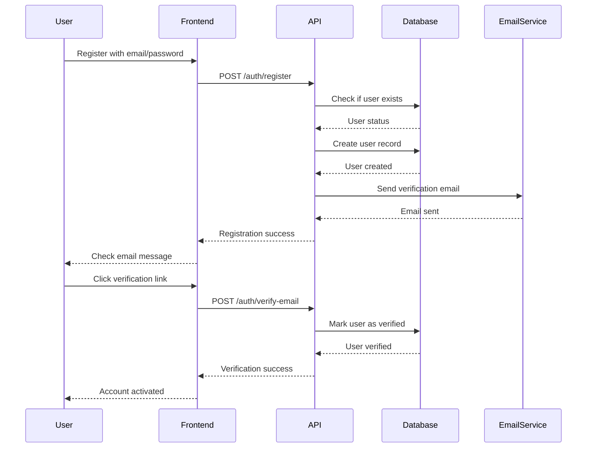
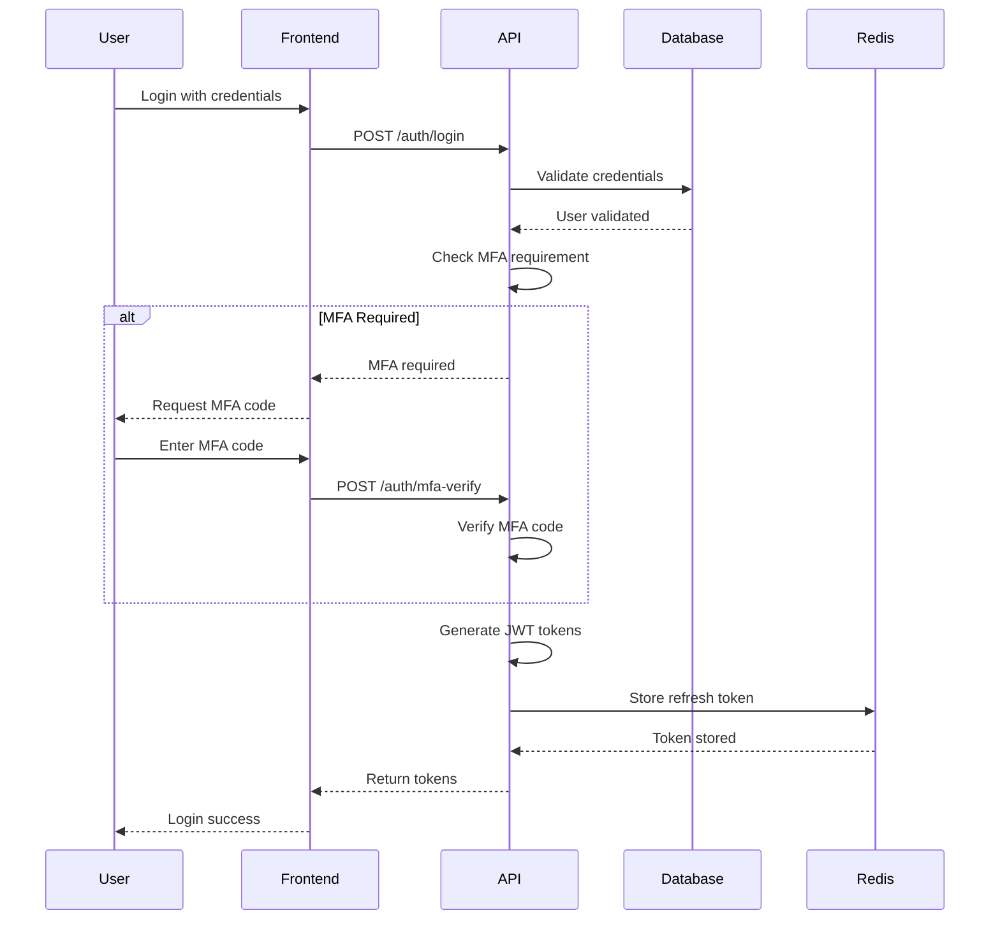

# Authentication & Access Control System Design

## Overview

The authentication and access control system is designed to support multiple user types with granular permissions, ensuring secure access to both business features and transparency platform capabilities while maintaining scalability and ease of management.

## User Types and Roles

### 1. User Type Hierarchy

```
┌─────────────────────────────────────────────────────────────────┐
│                          USER TYPES                             │
├─────────────────────────────────────────────────────────────────┤
│                                                                 │
│  ┌─────────────────┐  ┌─────────────────┐  ┌─────────────────┐ │
│  │   ANONYMOUS     │  │   REGISTERED    │  │   BUSINESS      │ │
│  │   USERS         │  │   CITIZENS      │  │   USERS         │ │
│  │                 │  │                 │  │                 │ │
│  │ • View public   │  │ • View public   │  │ • Advanced      │ │
│  │   tenders       │  │   tenders       │  │   search        │ │
│  │ • Basic         │  │ • Create        │  │ • Alerts        │ │
│  │   statistics    │  │   alerts        │  │ • Analytics     │ │
│  │ • Risk          │  │ • Save searches │  │ • Reports       │ │
│  │   transparency  │  │ • Comments      │  │ • API access    │ │
│  └─────────────────┘  └─────────────────┘  └─────────────────┘ │
│                                                                 │
│  ┌─────────────────┐  ┌─────────────────┐  ┌─────────────────┐ │
│  │   JOURNALIST    │  │   ADMIN         │  │   SUPER         │ │
│  │   USERS         │  │   USERS         │  │   ADMIN         │ │
│  │                 │  │                 │  │                 │ │
│  │ • Full access   │  │ • User          │  │ • System        │ │
│  │   to transparency│  │   management    │  │   management    │ │
│  │ • Investigation │  │ • Content       │  │ • Security      │ │
│  │   tools         │  │   moderation    │  │   settings      │ │
│  │ • Data export   │  │ • System        │  │ • All           │ │
│  │ • API access    │  │   monitoring    │  │   permissions   │ │
│  └─────────────────┘  └─────────────────┘  └─────────────────┘ │
│                                                                 │
└─────────────────────────────────────────────────────────────────┘
```

### 2. Role-Based Access Control (RBAC)

```python
# Role definitions
ROLES = {
    "anonymous": {
        "name": "Anonymous User",
        "permissions": [
            "view_public_tenders",
            "view_public_statistics",
            "view_risk_transparency"
        ]
    },
    "citizen": {
        "name": "Registered Citizen",
        "permissions": [
            "view_public_tenders",
            "view_public_statistics",
            "view_risk_transparency",
            "create_alerts",
            "save_searches",
            "comment_tenders"
        ]
    },
    "business_basic": {
        "name": "Business User - Basic",
        "permissions": [
            "view_public_tenders",
            "view_private_tenders",
            "advanced_search",
            "create_alerts",
            "save_searches",
            "basic_analytics",
            "export_data_limited"
        ]
    },
    "business_premium": {
        "name": "Business User - Premium",
        "permissions": [
            "view_public_tenders",
            "view_private_tenders",
            "advanced_search",
            "create_alerts",
            "save_searches",
            "full_analytics",
            "export_data_unlimited",
            "api_access",
            "competitor_analysis",
            "custom_reports"
        ]
    },
    "journalist": {
        "name": "Journalist",
        "permissions": [
            "view_public_tenders",
            "view_transparency_data",
            "investigation_tools",
            "bulk_data_export",
            "api_access",
            "advanced_risk_analysis"
        ]
    },
    "admin": {
        "name": "Administrator",
        "permissions": [
            "user_management",
            "content_moderation",
            "system_monitoring",
            "data_management",
            "report_generation"
        ]
    },
    "super_admin": {
        "name": "Super Administrator",
        "permissions": ["*"]  # All permissions
    }
}
```

## Authentication Architecture

### 1. JWT-Based Authentication

```python
# JWT Token Structure
{
    "header": {
        "alg": "HS256",
        "typ": "JWT"
    },
    "payload": {
        "sub": "user_id_123",
        "email": "user@example.com",
        "roles": ["business_premium"],
        "permissions": ["view_tenders", "create_alerts", "api_access"],
        "subscription": {
            "type": "premium",
            "expires_at": "2024-12-31T23:59:59Z"
        },
        "iat": 1640908800,
        "exp": 1640995200,
        "jti": "jwt_id_456"
    }
}

# Token Types
ACCESS_TOKEN_EXPIRE_MINUTES = 60
REFRESH_TOKEN_EXPIRE_DAYS = 30
API_TOKEN_EXPIRE_DAYS = 365
```

### 2. Multi-Factor Authentication (MFA)

```python
class MFAService:
    def __init__(self):
        self.totp_service = TOTPService()
        self.sms_service = SMSService()
        self.email_service = EmailService()
        
    def enable_mfa(self, user_id: str, method: str):
        """Enable MFA for user"""
        if method == "totp":
            return self.setup_totp(user_id)
        elif method == "sms":
            return self.setup_sms(user_id)
        elif method == "email":
            return self.setup_email(user_id)
            
    def verify_mfa(self, user_id: str, code: str, method: str):
        """Verify MFA code"""
        if method == "totp":
            return self.totp_service.verify(user_id, code)
        elif method == "sms":
            return self.sms_service.verify(user_id, code)
        elif method == "email":
            return self.email_service.verify(user_id, code)
```

## Permission System

### 1. Permission Definition

```python
# Permission categories
PERMISSION_CATEGORIES = {
    "tenders": {
        "view_public_tenders": "View public tender information",
        "view_private_tenders": "View private/restricted tenders",
        "view_tender_details": "View detailed tender information",
        "view_tender_documents": "Access tender documents",
        "export_tender_data": "Export tender data"
    },
    "search": {
        "basic_search": "Basic search functionality",
        "advanced_search": "Advanced search with filters",
        "saved_searches": "Save and manage searches",
        "search_alerts": "Create and manage search alerts"
    },
    "analytics": {
        "basic_analytics": "Basic analytics and statistics",
        "advanced_analytics": "Advanced analytics and insights",
        "competitor_analysis": "Competitor analysis tools",
        "market_intelligence": "Market intelligence features"
    },
    "transparency": {
        "view_risk_analysis": "View risk analysis data",
        "view_transparency_data": "Access transparency information",
        "investigation_tools": "Investigation and research tools",
        "bulk_data_export": "Bulk data export capabilities"
    },
    "user_management": {
        "manage_users": "Manage user accounts",
        "manage_roles": "Manage user roles and permissions",
        "view_user_activity": "View user activity logs",
        "moderate_content": "Content moderation capabilities"
    },
    "system": {
        "system_monitoring": "System monitoring and health",
        "data_management": "Data management operations",
        "security_settings": "Security configuration",
        "api_management": "API key and rate limit management"
    }
}
```

### 2. Permission Inheritance

```python
class PermissionManager:
    def __init__(self):
        self.permission_hierarchy = {
            "view_tender_details": ["view_public_tenders"],
            "view_private_tenders": ["view_public_tenders"],
            "advanced_search": ["basic_search"],
            "advanced_analytics": ["basic_analytics"],
            "manage_roles": ["manage_users"],
            "system_monitoring": ["view_user_activity"]
        }
        
    def get_effective_permissions(self, user_roles: List[str]) -> List[str]:
        """Get all effective permissions for user roles"""
        permissions = set()
        for role in user_roles:
            role_permissions = ROLES[role]["permissions"]
            if "*" in role_permissions:
                return list(PERMISSION_CATEGORIES.keys())
            permissions.update(role_permissions)
            
        # Add inherited permissions
        for permission in list(permissions):
            permissions.update(self.get_inherited_permissions(permission))
            
        return list(permissions)
```

## Authentication Flow

### 1. Registration Flow



### 2. Login Flow



## Security Features

### 1. Rate Limiting

```python
class RateLimiter:
    def __init__(self):
        self.redis_client = redis.Redis()
        self.limits = {
            "login_attempts": {"limit": 5, "window": 300},  # 5 attempts per 5 minutes
            "api_calls": {"limit": 1000, "window": 3600},   # 1000 calls per hour
            "password_reset": {"limit": 3, "window": 86400} # 3 resets per day
        }
        
    def check_rate_limit(self, user_id: str, action: str) -> bool:
        """Check if user has exceeded rate limit"""
        key = f"rate_limit:{user_id}:{action}"
        limit_config = self.limits[action]
        
        current_count = self.redis_client.incr(key)
        if current_count == 1:
            self.redis_client.expire(key, limit_config["window"])
            
        return current_count <= limit_config["limit"]
```

### 2. Session Management

```python
class SessionManager:
    def __init__(self):
        self.redis_client = redis.Redis()
        self.session_timeout = 3600  # 1 hour
        
    def create_session(self, user_id: str, device_info: dict) -> str:
        """Create new user session"""
        session_id = str(uuid.uuid4())
        session_data = {
            "user_id": user_id,
            "device_info": device_info,
            "created_at": datetime.utcnow().isoformat(),
            "last_activity": datetime.utcnow().isoformat()
        }
        
        self.redis_client.setex(
            f"session:{session_id}",
            self.session_timeout,
            json.dumps(session_data)
        )
        
        return session_id
        
    def validate_session(self, session_id: str) -> dict:
        """Validate and refresh session"""
        session_data = self.redis_client.get(f"session:{session_id}")
        if not session_data:
            return None
            
        session_data = json.loads(session_data)
        session_data["last_activity"] = datetime.utcnow().isoformat()
        
        self.redis_client.setex(
            f"session:{session_id}",
            self.session_timeout,
            json.dumps(session_data)
        )
        
        return session_data
```

### 3. Security Headers

```python
class SecurityMiddleware:
    def __init__(self, app):
        self.app = app
        
    async def __call__(self, scope, receive, send):
        if scope["type"] == "http":
            response = await self.app(scope, receive, send)
            
            # Add security headers
            headers = [
                (b"X-Content-Type-Options", b"nosniff"),
                (b"X-Frame-Options", b"DENY"),
                (b"X-XSS-Protection", b"1; mode=block"),
                (b"Strict-Transport-Security", b"max-age=31536000; includeSubDomains"),
                (b"Content-Security-Policy", b"default-src 'self'"),
                (b"Referrer-Policy", b"strict-origin-when-cross-origin")
            ]
            
            if response.get("headers"):
                response["headers"].extend(headers)
            else:
                response["headers"] = headers
                
        return response
```

## Access Control Implementation

### 1. Decorator-Based Authorization

```python
def require_permission(permission: str):
    """Decorator to require specific permission"""
    def decorator(func):
        @wraps(func)
        async def wrapper(*args, **kwargs):
            # Extract user from request context
            user = get_current_user()
            if not user:
                raise HTTPException(401, "Authentication required")
                
            # Check permission
            if not has_permission(user, permission):
                raise HTTPException(403, "Insufficient permissions")
                
            return await func(*args, **kwargs)
        return wrapper
    return decorator

# Usage example
@require_permission("view_private_tenders")
async def get_private_tenders(current_user: User = Depends(get_current_user)):
    return await tender_service.get_private_tenders()
```

### 2. Resource-Based Authorization

```python
class ResourceAuthorizer:
    def __init__(self):
        self.rules = {
            "tender": {
                "view": self.check_tender_view_permission,
                "edit": self.check_tender_edit_permission,
                "delete": self.check_tender_delete_permission
            },
            "user": {
                "view": self.check_user_view_permission,
                "edit": self.check_user_edit_permission,
                "delete": self.check_user_delete_permission
            }
        }
        
    def check_permission(self, user: User, resource_type: str, action: str, resource_id: str) -> bool:
        """Check if user has permission for specific resource action"""
        if resource_type not in self.rules:
            return False
            
        if action not in self.rules[resource_type]:
            return False
            
        return self.rules[resource_type][action](user, resource_id)
        
    def check_tender_view_permission(self, user: User, tender_id: str) -> bool:
        """Check if user can view specific tender"""
        tender = get_tender_by_id(tender_id)
        if not tender:
            return False
            
        # Public tenders can be viewed by anyone
        if tender.is_public:
            return True
            
        # Private tenders require special permission
        return has_permission(user, "view_private_tenders")
```

## Password Security

### 1. Password Hashing

```python
import bcrypt
import secrets

class PasswordManager:
    def __init__(self):
        self.rounds = 12  # bcrypt rounds
        
    def hash_password(self, password: str) -> str:
        """Hash password using bcrypt"""
        salt = bcrypt.gensalt(rounds=self.rounds)
        return bcrypt.hashpw(password.encode('utf-8'), salt).decode('utf-8')
        
    def verify_password(self, password: str, hashed: str) -> bool:
        """Verify password against hash"""
        return bcrypt.checkpw(password.encode('utf-8'), hashed.encode('utf-8'))
        
    def generate_secure_token(self, length: int = 32) -> str:
        """Generate secure random token"""
        return secrets.token_urlsafe(length)
```

### 2. Password Policy

```python
class PasswordPolicy:
    def __init__(self):
        self.min_length = 8
        self.max_length = 128
        self.require_uppercase = True
        self.require_lowercase = True
        self.require_digit = True
        self.require_special = True
        self.special_chars = "!@#$%^&*()_+-=[]{}|;:,.<>?"
        
    def validate_password(self, password: str) -> tuple[bool, list[str]]:
        """Validate password against policy"""
        errors = []
        
        if len(password) < self.min_length:
            errors.append(f"Password must be at least {self.min_length} characters")
            
        if len(password) > self.max_length:
            errors.append(f"Password must be no more than {self.max_length} characters")
            
        if self.require_uppercase and not any(c.isupper() for c in password):
            errors.append("Password must contain at least one uppercase letter")
            
        if self.require_lowercase and not any(c.islower() for c in password):
            errors.append("Password must contain at least one lowercase letter")
            
        if self.require_digit and not any(c.isdigit() for c in password):
            errors.append("Password must contain at least one digit")
            
        if self.require_special and not any(c in self.special_chars for c in password):
            errors.append("Password must contain at least one special character")
            
        return len(errors) == 0, errors
```

## API Key Management

### 1. API Key Generation

```python
class APIKeyManager:
    def __init__(self):
        self.redis_client = redis.Redis()
        self.key_prefix = "api_key:"
        
    def generate_api_key(self, user_id: str, permissions: List[str], expires_in_days: int = 365) -> str:
        """Generate API key for user"""
        key_id = str(uuid.uuid4())
        api_key = f"pk_{secrets.token_urlsafe(32)}"
        
        key_data = {
            "key_id": key_id,
            "user_id": user_id,
            "permissions": permissions,
            "created_at": datetime.utcnow().isoformat(),
            "expires_at": (datetime.utcnow() + timedelta(days=expires_in_days)).isoformat(),
            "last_used": None,
            "usage_count": 0
        }
        
        # Store in Redis with expiration
        self.redis_client.setex(
            f"{self.key_prefix}{api_key}",
            expires_in_days * 24 * 3600,
            json.dumps(key_data)
        )
        
        return api_key
        
    def validate_api_key(self, api_key: str) -> dict:
        """Validate API key and return user info"""
        key_data = self.redis_client.get(f"{self.key_prefix}{api_key}")
        if not key_data:
            return None
            
        key_data = json.loads(key_data)
        
        # Update usage statistics
        key_data["last_used"] = datetime.utcnow().isoformat()
        key_data["usage_count"] += 1
        
        # Save updated data
        self.redis_client.setex(
            f"{self.key_prefix}{api_key}",
            self.redis_client.ttl(f"{self.key_prefix}{api_key}"),
            json.dumps(key_data)
        )
        
        return key_data
```

## OAuth2 Integration (Future)

### 1. OAuth2 Provider Setup

```python
class OAuth2Provider:
    def __init__(self):
        self.providers = {
            "google": {
                "client_id": os.getenv("GOOGLE_CLIENT_ID"),
                "client_secret": os.getenv("GOOGLE_CLIENT_SECRET"),
                "authorization_url": "https://accounts.google.com/o/oauth2/auth",
                "token_url": "https://oauth2.googleapis.com/token",
                "user_info_url": "https://www.googleapis.com/oauth2/v2/userinfo"
            },
            "github": {
                "client_id": os.getenv("GITHUB_CLIENT_ID"),
                "client_secret": os.getenv("GITHUB_CLIENT_SECRET"),
                "authorization_url": "https://github.com/login/oauth/authorize",
                "token_url": "https://github.com/login/oauth/access_token",
                "user_info_url": "https://api.github.com/user"
            }
        }
        
    def get_authorization_url(self, provider: str, redirect_uri: str) -> str:
        """Get OAuth2 authorization URL"""
        config = self.providers[provider]
        params = {
            "client_id": config["client_id"],
            "redirect_uri": redirect_uri,
            "response_type": "code",
            "scope": "email profile"
        }
        return f"{config['authorization_url']}?{urlencode(params)}"
```

## Audit Logging

### 1. Authentication Audit

```python
class AuthAuditLogger:
    def __init__(self):
        self.logger = logging.getLogger("auth_audit")
        
    def log_login_attempt(self, user_id: str, ip_address: str, success: bool, reason: str = None):
        """Log login attempt"""
        self.logger.info({
            "event": "login_attempt",
            "user_id": user_id,
            "ip_address": ip_address,
            "success": success,
            "reason": reason,
            "timestamp": datetime.utcnow().isoformat()
        })
        
    def log_permission_check(self, user_id: str, permission: str, resource_id: str, granted: bool):
        """Log permission check"""
        self.logger.info({
            "event": "permission_check",
            "user_id": user_id,
            "permission": permission,
            "resource_id": resource_id,
            "granted": granted,
            "timestamp": datetime.utcnow().isoformat()
        })
```

## Configuration Management

### 1. Security Configuration

```yaml
# security.yaml
authentication:
  jwt:
    secret_key: "${JWT_SECRET_KEY}"
    algorithm: "HS256"
    access_token_expire_minutes: 60
    refresh_token_expire_days: 30
    
  password_policy:
    min_length: 8
    max_length: 128
    require_uppercase: true
    require_lowercase: true
    require_digit: true
    require_special: true
    
  rate_limiting:
    login_attempts: 5
    login_window: 300
    api_calls: 1000
    api_window: 3600
    
  mfa:
    enabled: true
    required_for_admin: true
    totp_issuer: "Romanian Procurement Platform"
    
  session:
    timeout: 3600
    secure_cookies: true
    same_site: "strict"
```

This authentication and access control system provides a comprehensive, secure, and scalable foundation for managing user access to the Romanian public procurement platform while supporting different user types and their specific needs.